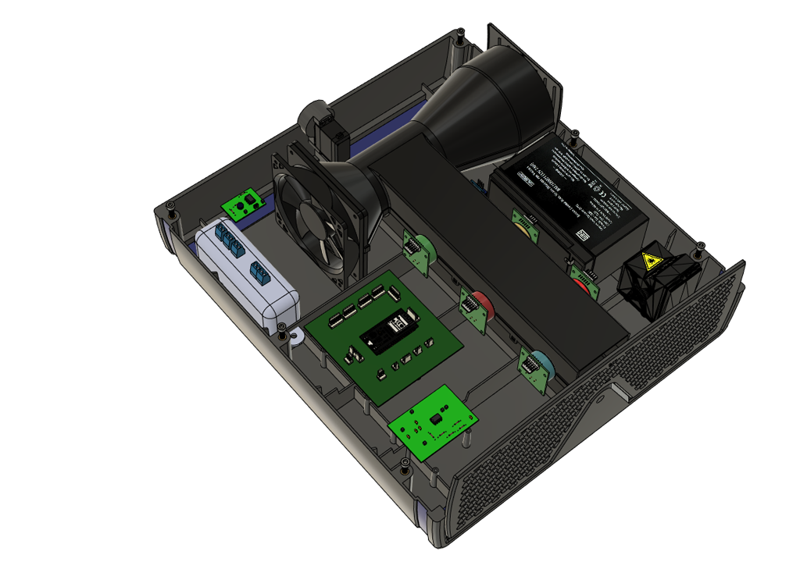

<h1 align="center">
      Estação de monitoramento ar Zéfiro
</h1>

      A estação de monitoramento de ar Zéfiro é um sistema de instrumentação Eletrônica modular, onde seus componentes são distríbuidos no melhor posicionamento para cada e as ligações realizadas por meio de cabos a central de controle, com o microcontroladro ESP32.
  
 

      

 
 
 
 - **Esquemático Geral** O esquemático geral representa todos os módulos e suas conexões entre si, enquanto cada pasta tem o desenvolvimento individual do esqumático e layout de pcb destes módulos.
  
  

      

  
  
 
  
  #### Desenvolvedores:
  Clara Justa
  
  Débora Janini
  
  Felipe Alcântara
  
  
