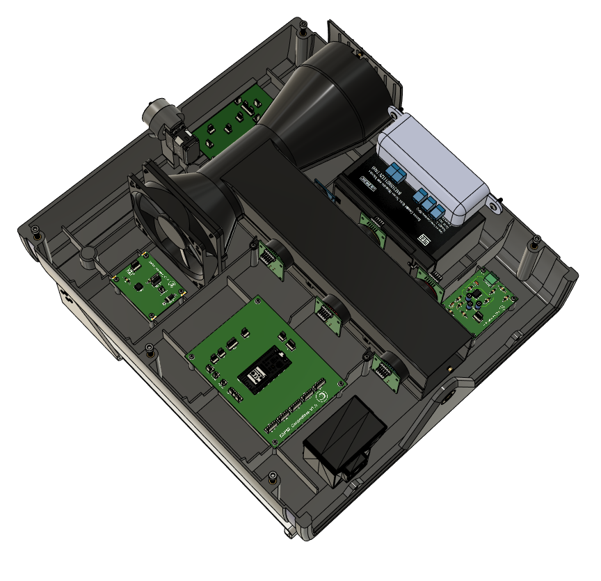

<h1 align="center">
      Eletrônica Analógica Zéfiro
</h1>

      A eletrônica analógica é aplicada na estação de monitoramento de ar Zéfiro, sendo um sistema de instrumentação eletrônica modular, onde seus componentes são distríbuidos no melhor posicionamento para seu uso e as ligações realizadas, por meio de cabos, com a central de controle, utilizando o microcontrolador ESP32.
  
 

        

 
 
 
 - **Esquemático Geral** O esquemático geral representa todos os módulos e suas conexões entre si, enquanto cada pasta tem o desenvolvimento individual do esqumático e layout de pcb destes módulos.
  
  

      

  
  
 
  
  #### Desenvolvedores:
  Clara Justa
  
  Débora Janini
  
  Felipe Alcântara

