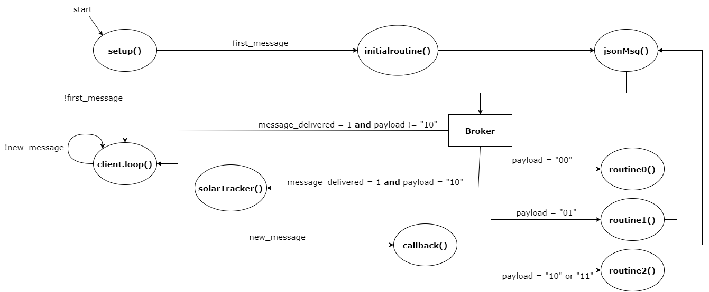

<h1 align="center">
      Sistema Embarcado Zéfiro
</h1>

      O sistema embarcado do Zéfiro, tem como função o controle da estação autônoma e a transmissão dos dados coletados para o servidor. O sistema embarcado foi desenvolvido no modelo máquina de estados, abaixo é possível verificar o diagrama da máquina de estados desenvolvido.

 

      

      

